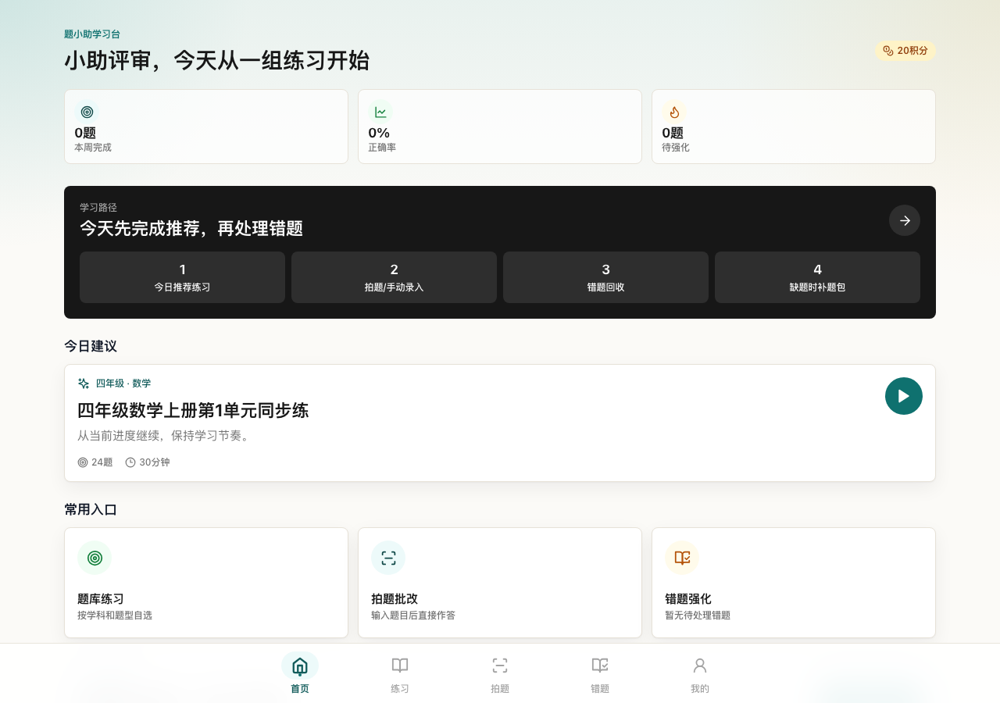
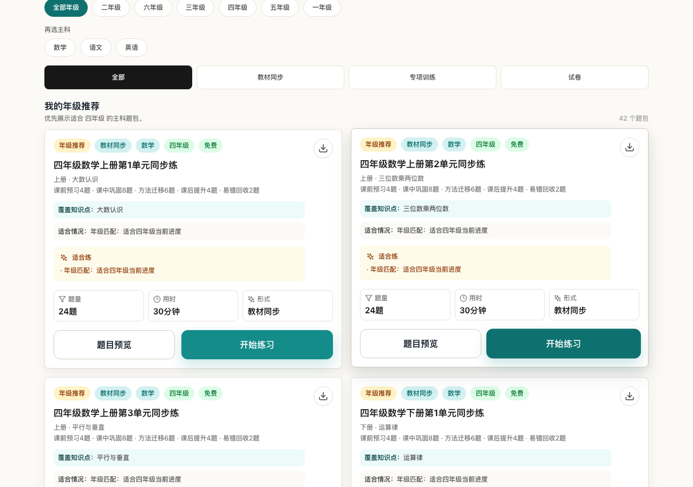
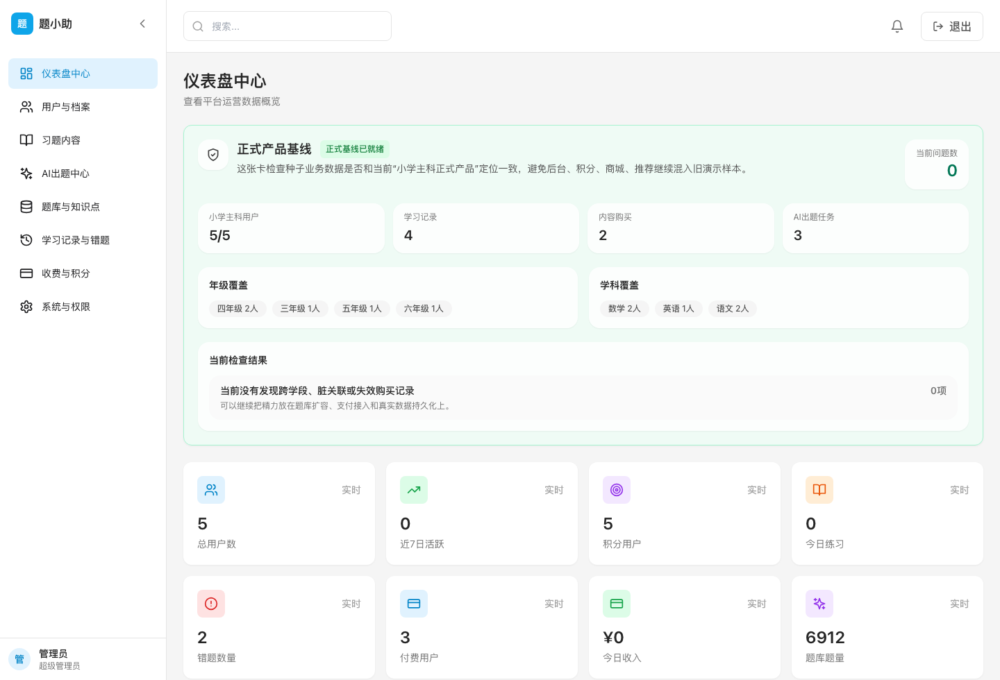

# Tixiaozhu

[](https://github.com/cxhihilwb123-hash/tixiaozhu-oss/actions/workflows/launch-gates.yml)
[](https://github.com/cxhihilwb123-hash/tixiaozhu-oss/releases)
[](LICENSE)

Tixiaozhu is an open-source Chinese education-product engineering sample. It includes a student app, an operations admin app, and a Node API for primary-school practice, question banks, wrong-question review, manual capture correction, points, orders, launch gates, and production-readiness checks. The student flow is designed around a daily learning path: finish today's recommended practice, capture or enter extra questions when needed, recycle wrong questions, and use the question store only when more targeted packs are needed.

This repository is licensed under GNU Affero General Public License v3.0 or later. Commercial use is allowed under AGPL terms. If a company wants proprietary use without AGPL obligations, contact the copyright holder for a separate commercial license. See [LICENSE](LICENSE) and [COMMERCIAL.md](COMMERCIAL.md).

## Contributors Wanted

Tixiaozhu is looking for honest reviewers and small, practical contributors. Good first contributions include running the Quick Start, reporting setup gaps, reviewing the education flow, improving docs, testing accessibility, and tightening CI/audit coverage.

Start here: [docs/join-the-project.md](docs/join-the-project.md).

Useful contributions may receive public recognition or optional maintainer-confirmed thank-you rewards. See [docs/contributor-rewards.md](docs/contributor-rewards.md).

## Highlights

- Student React/Vite app with onboarding, daily recommended practice, capture/manual-input correction, wrong-question recycling, a practice center, question-store fallback, and profile flows.
- Admin React/Vite app with login, dashboard, users, question packs, knowledge points, AI generation, learning records, billing, points, orders, refunds, and system settings.
- Node API with student/admin auth, local file persistence, PostgreSQL JSONB snapshot support, payment state flows, webhook verification, AI/OCR strategy gates, and static app serving.
- Question-bank product structure for primary-school Chinese, math, and English.
- Built-in audits for question-bank quality, product readiness, runtime security, commercial launch readiness, and production bundle residue.
- Production launch posture that explicitly blocks unsafe defaults instead of pretending local development is production-ready.

## Screenshots

Student learning dashboard:



Question store and primary-subject pack system:



Operations admin dashboard:



## Current Baseline

Recent local validation for this release baseline:

- `npm run build` passes.
- `npm --prefix backend run audit:question-bank` reports `252` question packs, `6912` questions, and `108` knowledge points.
- `npm --prefix backend run audit:product-readiness` reports `ready`.
- `npm --prefix backend run audit:runtime-security` passes auth, scoping, anonymous-access, and payment-deferral checks.
- `npm run audit:production-build` passes bundle residue checks.

Commercial launch readiness may still report `blocked` until a real production environment configures PostgreSQL, strong secrets, AI, object storage, monitoring, and public domains. That is expected.

## Tech Stack

- React 18, Vite, Tailwind CSS, Zustand, Framer Motion, Lucide icons.
- Node.js native HTTP server.
- PostgreSQL support through `pg`.
- Playwright for product-flow audits.
- Docker/PostgreSQL local migration helpers.

## Quick Start

Requirements:

- Node.js 20 or newer.
- npm.
- Docker only if you want to test local PostgreSQL migration.

Install dependencies:

```bash
npm ci
npm --prefix frontend ci
npm --prefix admin ci
npm --prefix backend ci
```

Start the API:

```bash
npm --prefix backend run dev
```

In separate terminals, start the student app and admin app:

```bash
npm --prefix frontend run dev
npm --prefix admin run dev
```

Default local URLs:

- Student app: `http://127.0.0.1:5173/`
- Admin app: `http://127.0.0.1:5174/`
- API: `http://127.0.0.1:8787/api`

Default local admin account:

```text
username: admin
password: admin123
```

The default admin account is for local development only. Do not use it in production.

## Verification

Run the core checks:

```bash
npm run build
npm --prefix backend run audit:question-bank
npm --prefix backend run audit:product-readiness
npm --prefix backend run audit:runtime-security
npm run audit:production-build
```

Optional UI checks:

```bash
npm run audit:launch-ui
npm run audit:interaction-qa
```

Optional dependency checks:

```bash
npm audit --omit=dev
npm --prefix frontend audit --omit=dev
npm --prefix admin audit --omit=dev
npm --prefix backend audit --omit=dev
```

## Project Structure

```text
frontend/   student-facing React/Vite app
admin/      operations React/Vite app
backend/    Node API, persistence, readiness gates, and audit scripts
api/        serverless-compatible backend entrypoint
docs/       launch, database, testing, architecture, and maintenance docs
```

More detail: [docs/architecture.md](docs/architecture.md).

API overview: [docs/api-reference.md](docs/api-reference.md).

Visual walkthrough: [docs/demo.md](docs/demo.md).

Contributor onboarding: [docs/join-the-project.md](docs/join-the-project.md).

Contributor rewards: [docs/contributor-rewards.md](docs/contributor-rewards.md).

Recent external feedback: [docs/release-notes-v0.1.1.md](docs/release-notes-v0.1.1.md).

## Environment Files

Real secrets must not be committed. Use deployment secrets or ignored local files.

Tracked examples:

- `.env.production.example`
- `.env.postgres.local.example`
- `.env.deepseek.local.example`

Ignored local files:

- `.env`
- `.env.*`
- `.env.local`
- `.env.deepseek.local`

Before publishing a fork or public repository, rotate any credentials that may have been exposed during local development and scan repository history.

## PostgreSQL Local Trial

Start local PostgreSQL:

```bash
npm run db:local:start
```

Export file-store data, import it into PostgreSQL, and verify the export:

```bash
npm run db:export:file
npm run db:import:local-postgres
npm run db:verify:local-postgres
```

More detail: [docs/postgres-setup.md](docs/postgres-setup.md).

## Production Readiness

Production-like environments should configure:

- `TIXIAOZHU_ENV=production`
- `TIXIAOZHU_DATA_LAYER=postgres`
- `DATABASE_URL`
- `ADMIN_USERNAME`
- `ADMIN_PASSWORD_HASH`
- `ADMIN_SESSION_SECRET`
- `STUDENT_SESSION_SECRET`
- `REQUIRE_STUDENT_AUTH=true`
- `AI_API_BASE`, `AI_API_KEY`, `AI_MODEL`
- Object storage settings
- Monitoring or log-drain settings
- `FRONTEND_URL`, `ADMIN_URL`, and `CORS_ALLOW_ORIGIN`

Payment and OCR can be deferred for a limited release:

```text
PAYMENT_LAUNCH_STRATEGY=deferred
OCR_LAUNCH_STRATEGY=deferred
```

Run:

```bash
npm --prefix backend run audit:commercial-launch
npm --prefix backend run preflight:production
```

See [docs/production-launch-runbook.md](docs/production-launch-runbook.md) and [docs/commercial-launch-plan.md](docs/commercial-launch-plan.md).

## Known Limits

- This public release is AGPL open source by default.
- It is not a turnkey commercial SaaS.
- The backend is functional but currently concentrated in a large `backend/src/server.js` file; modularization is a roadmap item.
- Local development uses file persistence unless PostgreSQL is configured.
- Real payment and real OCR integrations are intentionally gated/deferred unless configured.
- Public demo screenshots and videos should be sanitized before being committed.

## Contributing

Contributions are welcome. Start with [CONTRIBUTING.md](CONTRIBUTING.md), [ROADMAP.md](ROADMAP.md), [MAINTAINERS.md](MAINTAINERS.md), [docs/testing.md](docs/testing.md), and [docs/question-bank-contributing.md](docs/question-bank-contributing.md).

## Security

Please do not disclose vulnerabilities publicly before contacting the maintainer. See [SECURITY.md](SECURITY.md).

## License

Tixiaozhu is licensed under GNU Affero General Public License v3.0 or later.

You may use, modify, distribute, and run the project under AGPL terms. Proprietary commercial licensing is available separately; see [COMMERCIAL.md](COMMERCIAL.md) and [docs/license-faq.md](docs/license-faq.md).
